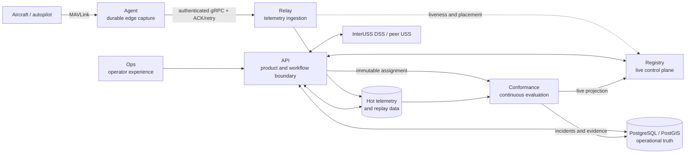

# Aero Arc

### Operational infrastructure for autonomous aviation

Connect aircraft, observe live operations, coordinate intent, monitor conformance, and preserve the evidence of what happened.

[Website](https://aeroarc.io) · [Platform](https://aeroarc.io/platform) · [Open source](https://aeroarc.io/open-source) · [Field notes](https://aeroarc.io/field-notes)

## What we are building

Aero Arc LLC is building an open infrastructure stack for drone and autonomous aircraft operations. It joins durable edge-to-cloud telemetry with live fleet state, four-dimensional operational intent, strategic deconfliction, continuous conformance, and flight replay.

The goal is a trustworthy path from **plan to proof**: describe an operation, coordinate it, observe the aircraft, detect meaningful deviations, and retain a replayable evidence trail.

The platform is under active development. It is BVLOS-readiness infrastructure—not an FAA approval, certified UTM service, or substitute for an operator's safety and compliance obligations.

## The mental map

There are three boundaries worth remembering:

- The **data plane** moves telemetry from aircraft through Agent and Relay into queryable storage.
- The **control and product plane** keeps live topology in Registry and durable operational truth behind API.
- The **assurance plane** compares observations with the exact accepted intent and produces conformance state and replayable evidence.

Shared [Protocol Buffers](https://github.com/Aero-Arc/aero-arc-protos) define service contracts. [DSS Clients](https://github.com/Aero-Arc/dss-clients) keep InterUSS wire types and authentication at the coordination boundary.

## Follow an operation

| Stage | What happens | Start here |
| --- | --- | --- |
| **Connect** | Capture MAVLink at the aircraft, persist before send, and survive unreliable links. | [Agent](https://github.com/Aero-Arc/aero-arc-agent) → [Relay](https://github.com/Aero-Arc/aero-arc-relay) |
| **Observe** | Normalize telemetry, track relay/agent liveness, and compose live fleet views. | [Relay](https://github.com/Aero-Arc/aero-arc-relay) → [Registry](https://github.com/Aero-Arc/aero-arc-registry) → [API](https://github.com/Aero-Arc/aero-arc-api) → [Ops](https://github.com/Aero-Arc/aero-arc-ops) |
| **Plan** | Represent aircraft operations as versioned 4D intent: geometry, altitude, time, and ownership. | [API](https://github.com/Aero-Arc/aero-arc-api) |
| **Deconflict** | Check local and peer operational volumes, preserve findings, and coordinate through InterUSS workflows. | [API](https://github.com/Aero-Arc/aero-arc-api) + [DSS Clients](https://github.com/Aero-Arc/dss-clients) |
| **Monitor** | Evaluate ordered telemetry against the exact active assignment and publish current posture. | [Conformance](https://github.com/Aero-Arc/aero-arc-conformance) |
| **Prove** | Reconcile flight history and retain intent versions, transitions, incidents, and replay evidence. | [Conformance](https://github.com/Aero-Arc/aero-arc-conformance) + [API](https://github.com/Aero-Arc/aero-arc-api) |

## Repository guide

### Fly data from edge to cloud

| Repository | Responsibility | Maturity |
| --- | --- | --- |
| [`aero-arc-agent`](https://github.com/Aero-Arc/aero-arc-agent) | Companion-computer client for MAVLink capture, local SQLite WAL, registration, backpressure, reconnect, and at-least-once delivery. | Working |
| [`aero-arc-relay`](https://github.com/Aero-Arc/aero-arc-relay) | Authenticated agent sessions, identity attribution, telemetry normalization, sink fan-out, metrics, and health. | Working |
| [`aero-arc-registry`](https://github.com/Aero-Arc/aero-arc-registry) | Replaceable, backend-agnostic live control plane for relay liveness and agent-to-relay ownership. It does not carry telemetry. | Working |

### Plan and operate flights

| Repository | Responsibility | Maturity |
| --- | --- | --- |
| [`aero-arc-api`](https://github.com/Aero-Arc/aero-arc-api) | UI-facing boundary for fleet records, live-state composition, operational intent, preflight, deconfliction, DSS publication, replay, and conformance views. | Working vertical slices; active development |
| [`aero-arc-ops`](https://github.com/Aero-Arc/aero-arc-ops) | Flutter operator console for fleet readiness, live operations, telemetry, intent, preflight, conformance, maintenance, records, and maps. | Active development |
| [`aero-arc-conformance`](https://github.com/Aero-Arc/aero-arc-conformance) | Always-on evaluation plane for immutable assignments, ordered telemetry, incidents, live projections, and replayable evidence. | Bounded prototype |

### Build against platform contracts

| Repository | Responsibility | Maturity |
| --- | --- | --- |
| [`aero-arc-protos`](https://github.com/Aero-Arc/aero-arc-protos) | Shared Protocol Buffer messages and gRPC service definitions used across Aero Arc components. | Shared contracts |
| [`dss-clients`](https://github.com/Aero-Arc/dss-clients) | Reproducible Go clients and authentication helpers generated from pinned InterUSS DSS OpenAPI definitions. | Working |
| [`interuss-dss`](https://github.com/Aero-Arc/interuss-dss) | Aero Arc's InterUSS DSS fork for local integration, standards investigation, and upstream-aligned testing. | Integration lab |

## Where should I go?

- **I have a real aircraft, companion computer, or SITL feed:** begin with [Agent](https://github.com/Aero-Arc/aero-arc-agent), then connect it to [Relay](https://github.com/Aero-Arc/aero-arc-relay).
- **I want to explore the product workflows:** run [API](https://github.com/Aero-Arc/aero-arc-api) with its demo seed, then point [Ops](https://github.com/Aero-Arc/aero-arc-ops) at it.
- **I am integrating a service:** use [Protos](https://github.com/Aero-Arc/aero-arc-protos) for Aero Arc RPC contracts and [DSS Clients](https://github.com/Aero-Arc/dss-clients) for InterUSS boundaries.
- **I care about strategic coordination:** read the deconfliction and DSS publication documentation in [API](https://github.com/Aero-Arc/aero-arc-api).
- **I care about continuous flight monitoring or evidence:** start with the design and current limitations in [Conformance](https://github.com/Aero-Arc/aero-arc-conformance).
- **I want the public overview before reading code:** visit [aeroarc.io/platform](https://aeroarc.io/platform) and the [field notes](https://aeroarc.io/field-notes).

## How we think about the system

- **One owner for each kind of truth.** Registry owns what is live now; time-series storage owns what was observed; PostgreSQL/PostGIS owns durable operational and audit records; object storage owns immutable replay artifacts.
- **Durability begins at the edge.** Agent writes telemetry to its WAL before transmission and treats explicit Relay acknowledgements as the delivery boundary.
- **Identity is explicit.** Operator, aircraft, agent installation, relay, session, flight, intent, and telemetry frame are different identities with different lifecycles.
- **The API is the product boundary.** Operator clients do not reach into Relay, Registry, databases, or telemetry stores directly.
- **Coordination is standards-shaped, not standards-coupled.** Aero Arc owns its domain model; InterUSS and other external contracts remain adapters at the edge.
- **Evidence must be reproducible.** An alert is useful; the authoritative intent version, ordered observations, state transitions, and deterministic replay are what make it explainable.

## Build with us

Each repository documents its own setup, guarantees, limitations, and validation commands. Choose the boundary closest to your work, read its README and design notes, and open a focused issue or pull request there.

We are especially interested in collaboration with UAS operators, robotics teams, autopilot and companion-computer developers, UTM/USS implementers, geospatial engineers, and distributed-systems contributors.

Learn more at [aeroarc.io](https://aeroarc.io) or [get in touch](https://aeroarc.io/contact).
